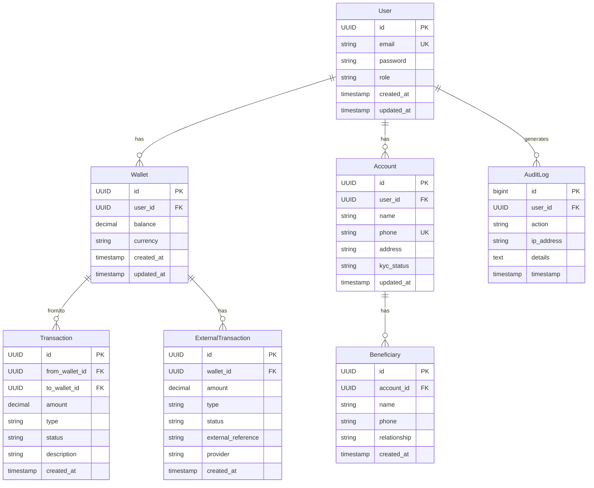

# Payme - Digital Wallet Backend

A secure and scalable digital wallet backend built with Spring Boot, providing comprehensive payment and transaction management capabilities.

## 🚀 Technology Stack

### Core Framework
- **Java 21** - Programming language
- **Spring Boot 4.0.0** - Application framework
- **Maven** - Dependency management and build tool

### Spring Ecosystem
- **Spring Web** - RESTful API development
- **Spring Data JPA** - Database ORM and repository pattern
- **Spring Security** - Authentication and authorization
- **Spring Validation** - Request validation

### Database
- **PostgreSQL 16.9** - Primary database
- **Flyway** - Database migration management
- **UUID-OSSP** - UUID generation extension
- **pgcrypto** - Cryptographic functions extension

### Security
- **JWT (JSON Web Tokens)** - Token-based authentication
  - jjwt-api 0.11.5
  - jjwt-impl 0.11.5
  - jjwt-jackson 0.11.5
- **BCrypt** - Password hashing

### Additional Libraries
- **Bucket4j 7.6.0** - Rate limiting
- **Lombok** - Boilerplate code reduction

## 📊 Entity Relationship Diagram



## 🏗️ Architecture

### Layered Architecture
```
┌─────────────────────────────────────┐
│         Controllers (API)           │
│    /api/v1/{auth,users,wallets,    │
│         transactions}               │
├─────────────────────────────────────┤
│         Services (Business)         │
│  AuthService, UserService, etc.    │
├─────────────────────────────────────┤
│      Repositories (Data Access)     │
│    JPA Repositories                 │
├─────────────────────────────────────┤
│         Domain (Entities)           │
│  User, Wallet, Transaction, etc.   │
└─────────────────────────────────────┘
```

### Key Features
- **JWT Authentication** - Secure token-based auth with custom `@CurrentUser` annotation
- **Role-Based Access Control** - User roles and permissions
- **Rate Limiting** - API request throttling with Bucket4j
- **Audit Logging** - Comprehensive activity tracking
- **Transaction Management** - Wallet-to-wallet transfers
- **External Transactions** - Top-up and withdrawal support
- **Beneficiary Management** - Saved payment recipients
- **KYC Support** - Account verification workflow

## 🔧 Setup Instructions

### Prerequisites
- Java 21 or higher
- PostgreSQL 16+
- Maven 3.6+

### Database Setup
```sql
-- Create database
CREATE DATABASE payme;

-- Connect to database
\c payme

-- Create extensions
CREATE EXTENSION IF NOT EXISTS "uuid-ossp";
CREATE EXTENSION IF NOT EXISTS "pgcrypto";
```

### Configuration
Update `src/main/resources/application.properties`:
```properties
# Database
spring.datasource.url=jdbc:postgresql://localhost:5432/payme
spring.datasource.username=your_username
spring.datasource.password=your_password

# JWT
jwt.secret=your-secret-key-here
jwt.expiration=86400000
```

### Build & Run
```bash
# Clean and build
./mvnw clean install

# Run application
./mvnw spring-boot:run
```

The application will start on `http://localhost:8080`

## 📡 API Endpoints

### Authentication
- `POST /api/v1/auth/register` - User registration
- `POST /api/v1/auth/login` - User login

### Users
- `GET /api/v1/users/me` - Get current user
- `GET /api/v1/users/{id}` - Get user by ID

### Wallets
- `GET /api/v1/wallets/my-wallet` - Get current user's wallet
- `GET /api/v1/wallets/{id}` - Get wallet by ID

### Transactions
- `POST /api/v1/transactions/send` - Send money
- `GET /api/v1/transactions/history` - Get transaction history
- `GET /api/v1/transactions/recent` - Get recent transactions

## 🔒 Security

- All endpoints except `/api/v1/auth/**` require JWT authentication
- Passwords are hashed using BCrypt
- Rate limiting applied to prevent abuse
- Audit logging for all critical operations

## 📝 Database Migrations

Migrations are managed by Flyway and located in `src/main/resources/db/migration/`:
- `V1` - Create users table
- `V2` - Create wallets table
- `V3` - Create transactions table
- `V4` - Create audit logs table
- `V5` - Refine relationships
- `V6` - Advanced architecture (accounts, external transactions, beneficiaries)

## 🧪 Testing

```bash
# Run tests
./mvnw test

# Run with coverage
./mvnw test jacoco:report
```

## 📦 Project Structure

```
src/main/java/com/itwizard/payme/
├── config/          # Configuration classes
├── controller/      # REST controllers
├── domain/          # Entity classes
├── dto/            # Data Transfer Objects
├── exception/      # Custom exceptions
├── repository/     # JPA repositories
├── security/       # Security components
└── service/        # Business logic
```

## 🤝 Contributing

1. Fork the repository
2. Create a feature branch
3. Commit your changes
4. Push to the branch
5. Create a Pull Request

## 📄 License

This project is licensed under the MIT License.

## 👥 Authors

- **IT Wizard Team**

## 📞 Support

For support, email support@itwizard.com or create an issue in the repository.
